**Setup**

```r
library(kernlab)
# library(car)
library(ggplot2)
library(corrgram)
```

```
## Loading required package: seriation
```

```r
library(vcd)
```

```
## Loading required package: grid
```

```r
library(rpart)
library(randomForest)
```

```
## randomForest 4.6-7
## Type rfNews() to see new features/changes/bug fixes.
```

```r
library(e1071)
```


1. Introduction
============


2. Process
=======
2.1 Data Preparation
----------------
### 2.1.1 Import Dataset

```r
data(ticdata)
# raw <- read.csv('../ticdata2000.csv')
data <- ticdata[1:5822, ]
```

### 2.1.2 Modify Datatypes

```r
# categorical_names <- grep('^m|^caravan', names(data)) # not needed for
# kernlab data[,categorical_names] <- lapply(data[,categorical_names],
# as.factor)
dc <- as.data.frame(lapply(data, as.factor))  # transform all to categorical

str(dc)
```

```
## 'data.frame':	5822 obs. of  86 variables:
##  $ STYPE   : Factor w/ 39 levels "Affluent senior apartments",..: 15 20 20 21 11 36 13 15 15 7 ...
##  $ MAANTHUI: Factor w/ 9 levels "1","2","3","4",..: 1 1 1 1 1 1 2 1 1 2 ...
##  $ MGEMOMV : Factor w/ 5 levels "1","2","3","4",..: 3 2 2 3 4 2 3 2 2 3 ...
##  $ MGEMLEEF: Factor w/ 6 levels "20-30","30-40",..: 2 2 2 3 2 1 2 3 4 3 ...
##  $ MOSHOOFD: Factor w/ 10 levels "Average Family",..: 6 6 6 1 7 8 3 6 6 1 ...
##  $ MGODRK  : Ord.factor w/ 10 levels "0%"<"1 - 10%"<..: 1 2 1 3 2 1 3 1 1 4 ...
##  $ MGODPR  : Ord.factor w/ 10 levels "0%"<"1 - 10%"<..: 6 5 5 4 5 6 3 8 2 6 ...
##  $ MGODOV  : Ord.factor w/ 10 levels "0%"<"1 - 10%"<..: 2 2 3 3 2 1 1 1 4 1 ...
##  $ MGODGE  : Ord.factor w/ 10 levels "0%"<"1 - 10%"<..: 4 5 5 5 5 6 6 3 7 3 ...
##  $ MRELGE  : Ord.factor w/ 10 levels "0%"<"1 - 10%"<..: 8 7 4 6 8 1 8 8 7 8 ...
##  $ MRELSA  : Ord.factor w/ 10 levels "0%"<"1 - 10%"<..: 1 3 3 3 2 7 3 3 1 1 ...
##  $ MRELOV  : Ord.factor w/ 10 levels "0%"<"1 - 10%"<..: 3 3 5 3 3 4 1 1 4 3 ...
##  $ MFALLEEN: Ord.factor w/ 10 levels "0%"<"1 - 10%"<..: 2 1 5 3 3 4 1 1 4 3 ...
##  $ MFGEKIND: Ord.factor w/ 10 levels "0%"<"1 - 10%"<..: 3 5 5 4 5 6 4 6 4 3 ...
##  $ MFWEKIND: Ord.factor w/ 10 levels "0%"<"1 - 10%"<..: 7 6 3 5 5 3 7 5 4 7 ...
##  $ MOPLHOOG: Ord.factor w/ 10 levels "0%"<"1 - 10%"<..: 2 1 1 4 6 1 1 1 1 1 ...
##  $ MOPLMIDD: Ord.factor w/ 10 levels "0%"<"1 - 10%"<..: 3 6 6 5 5 6 5 4 2 5 ...
##  $ MOPLLAAG: Ord.factor w/ 10 levels "0%"<"1 - 10%"<..: 8 5 5 3 1 5 6 7 9 6 ...
##  $ MBERHOOG: Ord.factor w/ 10 levels "0%"<"1 - 10%"<..: 2 1 1 5 1 3 1 3 2 3 ...
##  $ MBERZELF: Ord.factor w/ 10 levels "0%"<"1 - 10%"<..: 1 1 1 1 6 1 1 1 2 1 ...
##  $ MBERBOER: Ord.factor w/ 10 levels "0%"<"1 - 10%"<..: 2 1 1 1 5 1 1 1 1 1 ...
##  $ MBERMIDD: Ord.factor w/ 10 levels "0%"<"1 - 10%"<..: 3 6 8 4 1 5 5 3 2 4 ...
##  $ MBERARBG: Ord.factor w/ 10 levels "0%"<"1 - 10%"<..: 6 1 1 2 1 3 2 6 9 4 ...
##  $ MBERARBO: Ord.factor w/ 10 levels "0%"<"1 - 10%"<..: 3 5 3 3 1 3 6 3 2 4 ...
##  $ MSKA    : Ord.factor w/ 10 levels "0%"<"1 - 10%"<..: 2 1 1 4 10 3 1 3 2 2 ...
##  $ MSKB1   : Ord.factor w/ 10 levels "0%"<"1 - 10%"<..: 2 3 6 3 1 3 2 2 2 3 ...
##  $ MSKB2   : Ord.factor w/ 10 levels "0%"<"1 - 10%"<..: 3 4 1 2 1 3 5 3 1 2 ...
##  $ MSKC    : Ord.factor w/ 10 levels "0%"<"1 - 10%"<..: 7 6 5 5 1 5 6 6 9 5 ...
##  $ MSKD    : Ord.factor w/ 10 levels "0%"<"1 - 10%"<..: 2 1 1 1 1 3 1 3 2 3 ...
##  $ MHHUUR  : Ord.factor w/ 10 levels "0%"<"1 - 10%"<..: 2 3 8 6 5 10 7 1 10 1 ...
##  $ MHKOOP  : Ord.factor w/ 10 levels "0%"<"1 - 10%"<..: 9 8 3 5 6 1 4 10 1 10 ...
##  $ MAUT1   : Ord.factor w/ 10 levels "0%"<"1 - 10%"<..: 9 8 8 10 7 6 9 5 6 7 ...
##  $ MAUT2   : Ord.factor w/ 10 levels "0%"<"1 - 10%"<..: 1 2 1 1 3 4 1 5 3 2 ...
##  $ MAUT0   : Ord.factor w/ 10 levels "0%"<"1 - 10%"<..: 2 3 3 1 2 4 2 3 4 3 ...
##  $ MZFONDS : Ord.factor w/ 10 levels "0%"<"1 - 10%"<..: 9 7 10 8 6 10 10 7 8 7 ...
##  $ MZPART  : Ord.factor w/ 10 levels "0%"<"1 - 10%"<..: 2 4 1 3 5 1 1 4 3 4 ...
##  $ MINKM30 : Ord.factor w/ 10 levels "0%"<"1 - 10%"<..: 1 3 5 2 1 6 5 3 8 3 ...
##  $ MINK3045: Ord.factor w/ 10 levels "0%"<"1 - 10%"<..: 5 1 6 6 1 3 4 6 3 4 ...
##  $ MINK4575: Ord.factor w/ 10 levels "0%"<"1 - 10%"<..: 6 6 1 4 10 4 4 4 2 4 ...
##  $ MINK7512: Ord.factor w/ 10 levels "0%"<"1 - 10%"<..: 1 3 1 1 1 1 1 1 1 2 ...
##  $ MINK123M: Ord.factor w/ 10 levels "0%"<"1 - 10%"<..: 1 1 1 1 1 1 1 1 1 1 ...
##  $ MINKGEM : Ord.factor w/ 10 levels "0%"<"1 - 10%"<..: 5 6 4 5 7 4 4 4 3 5 ...
##  $ MKOOPKLA: Ord.factor w/ 10 levels "0%"<"1 - 10%"<..: 4 5 5 5 4 4 6 4 4 8 ...
##  $ PWAPART : Ord.factor w/ 10 levels "f 0"<"f 1-49"<..: 1 3 3 1 1 1 1 1 1 3 ...
##  $ PWABEDR : Ord.factor w/ 10 levels "f 0"<"f 1-49"<..: 1 1 1 1 1 1 1 1 1 1 ...
##  $ PWALAND : Ord.factor w/ 10 levels "f 0"<"f 1-49"<..: 1 1 1 1 1 1 1 1 1 1 ...
##  $ PPERSAUT: Ord.factor w/ 10 levels "f 0"<"f 1-49"<..: 7 1 7 7 1 7 7 1 6 1 ...
##  $ PBESAUT : Ord.factor w/ 10 levels "f 0"<"f 1-49"<..: 1 1 1 1 1 1 1 1 1 1 ...
##  $ PMOTSCO : Ord.factor w/ 10 levels "f 0"<"f 1-49"<..: 1 1 1 1 1 1 1 1 1 1 ...
##  $ AAUT    : Ord.factor w/ 10 levels "f 0"<"f 1-49"<..: 1 1 1 1 1 1 1 1 1 1 ...
##  $ PAANHANG: Ord.factor w/ 10 levels "f 0"<"f 1-49"<..: 1 1 1 1 1 1 1 1 1 1 ...
##  $ PTRACTOR: Ord.factor w/ 10 levels "f 0"<"f 1-49"<..: 1 1 1 1 1 1 1 1 1 1 ...
##  $ PWERKT  : Ord.factor w/ 10 levels "f 0"<"f 1-49"<..: 1 1 1 1 1 1 1 1 1 1 ...
##  $ PBROM   : Ord.factor w/ 10 levels "f 0"<"f 1-49"<..: 1 1 1 1 1 1 1 4 1 1 ...
##  $ PLEVEN  : Ord.factor w/ 10 levels "f 0"<"f 1-49"<..: 1 1 1 1 1 1 1 1 1 1 ...
##  $ PPERSONG: Ord.factor w/ 10 levels "f 0"<"f 1-49"<..: 1 1 1 1 1 1 1 1 1 1 ...
##  $ PGEZONG : Ord.factor w/ 10 levels "f 0"<"f 1-49"<..: 1 1 1 1 1 1 1 1 1 1 ...
##  $ PWAOREG : Ord.factor w/ 10 levels "f 0"<"f 1-49"<..: 1 1 1 1 1 1 1 1 1 1 ...
##  $ PBRAND  : Ord.factor w/ 10 levels "f 0"<"f 1-49"<..: 6 3 3 3 7 1 1 1 1 4 ...
##  $ PZEILPL : Ord.factor w/ 10 levels "f 0"<"f 1-49"<..: 1 1 1 1 1 1 1 1 1 1 ...
##  $ PPLEZIER: Ord.factor w/ 10 levels "f 0"<"f 1-49"<..: 1 1 1 1 1 1 1 1 1 1 ...
##  $ PFIETS  : Ord.factor w/ 10 levels "f 0"<"f 1-49"<..: 1 1 1 1 1 1 1 1 1 1 ...
##  $ PINBOED : Ord.factor w/ 10 levels "f 0"<"f 1-49"<..: 1 1 1 1 1 1 1 1 1 1 ...
##  $ PBYSTAND: Ord.factor w/ 10 levels "f 0"<"f 1-49"<..: 1 1 1 1 1 1 1 1 1 1 ...
##  $ AWAPART : Factor w/ 3 levels "0","1","2": 1 3 2 1 1 1 1 1 1 2 ...
##  $ AWABEDR : Factor w/ 3 levels "0","1","5": 1 1 1 1 1 1 1 1 1 1 ...
##  $ AWALAND : Factor w/ 2 levels "0","1": 1 1 1 1 1 1 1 1 1 1 ...
##  $ APERSAUT: Factor w/ 7 levels "0","1","2","3",..: 2 1 2 2 1 2 2 1 2 1 ...
##  $ ABESAUT : Factor w/ 5 levels "0","1","2","3",..: 1 1 1 1 1 1 1 1 1 1 ...
##  $ AMOTSCO : Factor w/ 4 levels "0","1","2","8": 1 1 1 1 1 1 1 1 1 1 ...
##  $ AVRAAUT : Factor w/ 4 levels "0","1","2","3": 1 1 1 1 1 1 1 1 1 1 ...
##  $ AAANHANG: Factor w/ 4 levels "0","1","2","3": 1 1 1 1 1 1 1 1 1 1 ...
##  $ ATRACTOR: Factor w/ 5 levels "0","1","2","3",..: 1 1 1 1 1 1 1 1 1 1 ...
##  $ AWERKT  : Factor w/ 5 levels "0","1","2","3",..: 1 1 1 1 1 1 1 1 1 1 ...
##  $ ABROM   : Factor w/ 3 levels "0","1","2": 1 1 1 1 1 1 1 2 1 1 ...
##  $ ALEVEN  : Factor w/ 6 levels "0","1","2","3",..: 1 1 1 1 1 1 1 1 1 1 ...
##  $ APERSONG: Factor w/ 2 levels "0","1": 1 1 1 1 1 1 1 1 1 1 ...
##  $ AGEZONG : Factor w/ 2 levels "0","1": 1 1 1 1 1 1 1 1 1 1 ...
##  $ AWAOREG : Factor w/ 3 levels "0","1","2": 1 1 1 1 1 1 1 1 1 1 ...
##  $ ABRAND  : Factor w/ 7 levels "0","1","2","3",..: 2 2 2 2 2 1 1 1 1 2 ...
##  $ AZEILPL : Factor w/ 2 levels "0","1": 1 1 1 1 1 1 1 1 1 1 ...
##  $ APLEZIER: Factor w/ 3 levels "0","1","2": 1 1 1 1 1 1 1 1 1 1 ...
##  $ AFIETS  : Factor w/ 4 levels "0","1","2","3": 1 1 1 1 1 1 1 1 1 1 ...
##  $ AINBOED : Factor w/ 3 levels "0","1","2": 1 1 1 1 1 1 1 1 1 1 ...
##  $ ABYSTAND: Factor w/ 3 levels "0","1","2": 1 1 1 1 1 1 1 1 1 1 ...
##  $ CARAVAN : Factor w/ 2 levels "noinsurance",..: 1 1 1 1 1 1 1 1 1 1 ...
```

```r
head(dc)
```

```
##                        STYPE MAANTHUI MGEMOMV MGEMLEEF
## 1 Lower class large families        1       3    30-40
## 2  Mixed small town dwellers        1       2    30-40
## 3  Mixed small town dwellers        1       2    30-40
## 4  Modern, complete families        1       3    40-50
## 5         Large family farms        1       4    30-40
## 6           Young and rising        1       2    20-30
##                MOSHOOFD   MGODRK   MGODPR   MGODOV   MGODGE   MRELGE
## 1 Family with grown ups       0% 50 - 62%  1 - 10% 24 - 36% 76 - 88%
## 2 Family with grown ups  1 - 10% 37 - 49%  1 - 10% 37 - 49% 63 - 75%
## 3 Family with grown ups       0% 37 - 49% 11 - 23% 37 - 49% 24 - 36%
## 4        Average Family 11 - 23% 24 - 36% 11 - 23% 37 - 49% 50 - 62%
## 5               Farmers  1 - 10% 37 - 49%  1 - 10% 37 - 49% 76 - 88%
## 6           Living well       0% 50 - 62%       0% 50 - 62%       0%
##     MRELSA   MRELOV MFALLEEN MFGEKIND MFWEKIND MOPLHOOG MOPLMIDD MOPLLAAG
## 1       0% 11 - 23%  1 - 10% 11 - 23% 63 - 75%  1 - 10% 11 - 23% 76 - 88%
## 2 11 - 23% 11 - 23%       0% 37 - 49% 50 - 62%       0% 50 - 62% 37 - 49%
## 3 11 - 23% 37 - 49% 37 - 49% 37 - 49% 11 - 23%       0% 50 - 62% 37 - 49%
## 4 11 - 23% 11 - 23% 11 - 23% 24 - 36% 37 - 49% 24 - 36% 37 - 49% 11 - 23%
## 5  1 - 10% 11 - 23% 11 - 23% 37 - 49% 37 - 49% 50 - 62% 37 - 49%       0%
## 6 63 - 75% 24 - 36% 24 - 36% 50 - 62% 11 - 23%       0% 50 - 62% 37 - 49%
##   MBERHOOG MBERZELF MBERBOER MBERMIDD MBERARBG MBERARBO     MSKA    MSKB1
## 1  1 - 10%       0%  1 - 10% 11 - 23% 50 - 62% 11 - 23%  1 - 10%  1 - 10%
## 2       0%       0%       0% 50 - 62%       0% 37 - 49%       0% 11 - 23%
## 3       0%       0%       0% 76 - 88%       0% 11 - 23%       0% 50 - 62%
## 4 37 - 49%       0%       0% 24 - 36%  1 - 10% 11 - 23% 24 - 36% 11 - 23%
## 5       0% 50 - 62% 37 - 49%       0%       0%       0%     100%       0%
## 6 11 - 23%       0%       0% 37 - 49% 11 - 23% 11 - 23% 11 - 23% 11 - 23%
##      MSKB2     MSKC     MSKD   MHHUUR   MHKOOP    MAUT1    MAUT2    MAUT0
## 1 11 - 23% 63 - 75%  1 - 10%  1 - 10% 89 - 99% 89 - 99%       0%  1 - 10%
## 2 24 - 36% 50 - 62%       0% 11 - 23% 76 - 88% 76 - 88%  1 - 10% 11 - 23%
## 3       0% 37 - 49%       0% 76 - 88% 11 - 23% 76 - 88%       0% 11 - 23%
## 4  1 - 10% 37 - 49%       0% 50 - 62% 37 - 49%     100%       0%       0%
## 5       0%       0%       0% 37 - 49% 50 - 62% 63 - 75% 11 - 23%  1 - 10%
## 6 11 - 23% 37 - 49% 11 - 23%     100%       0% 50 - 62% 24 - 36% 24 - 36%
##    MZFONDS   MZPART  MINKM30 MINK3045 MINK4575 MINK7512 MINK123M  MINKGEM
## 1 89 - 99%  1 - 10%       0% 37 - 49% 50 - 62%       0%       0% 37 - 49%
## 2 63 - 75% 24 - 36% 11 - 23%       0% 50 - 62% 11 - 23%       0% 50 - 62%
## 3     100%       0% 37 - 49% 50 - 62%       0%       0%       0% 24 - 36%
## 4 76 - 88% 11 - 23%  1 - 10% 50 - 62% 24 - 36%       0%       0% 37 - 49%
## 5 50 - 62% 37 - 49%       0%       0%     100%       0%       0% 63 - 75%
## 6     100%       0% 50 - 62% 11 - 23% 24 - 36%       0%       0% 24 - 36%
##   MKOOPKLA PWAPART PWABEDR PWALAND    PPERSAUT PBESAUT PMOTSCO AAUT
## 1 24 - 36%     f 0     f 0     f 0 f 1000-4999     f 0     f 0  f 0
## 2 37 - 49% f 50-99     f 0     f 0         f 0     f 0     f 0  f 0
## 3 37 - 49% f 50-99     f 0     f 0 f 1000-4999     f 0     f 0  f 0
## 4 37 - 49%     f 0     f 0     f 0 f 1000-4999     f 0     f 0  f 0
## 5 24 - 36%     f 0     f 0     f 0         f 0     f 0     f 0  f 0
## 6 24 - 36%     f 0     f 0     f 0 f 1000-4999     f 0     f 0  f 0
##   PAANHANG PTRACTOR PWERKT PBROM PLEVEN PPERSONG PGEZONG PWAOREG
## 1      f 0      f 0    f 0   f 0    f 0      f 0     f 0     f 0
## 2      f 0      f 0    f 0   f 0    f 0      f 0     f 0     f 0
## 3      f 0      f 0    f 0   f 0    f 0      f 0     f 0     f 0
## 4      f 0      f 0    f 0   f 0    f 0      f 0     f 0     f 0
## 5      f 0      f 0    f 0   f 0    f 0      f 0     f 0     f 0
## 6      f 0      f 0    f 0   f 0    f 0      f 0     f 0     f 0
##        PBRAND PZEILPL PPLEZIER PFIETS PINBOED PBYSTAND AWAPART AWABEDR
## 1   f 500-999     f 0      f 0    f 0     f 0      f 0       0       0
## 2     f 50-99     f 0      f 0    f 0     f 0      f 0       2       0
## 3     f 50-99     f 0      f 0    f 0     f 0      f 0       1       0
## 4     f 50-99     f 0      f 0    f 0     f 0      f 0       0       0
## 5 f 1000-4999     f 0      f 0    f 0     f 0      f 0       0       0
## 6         f 0     f 0      f 0    f 0     f 0      f 0       0       0
##   AWALAND APERSAUT ABESAUT AMOTSCO AVRAAUT AAANHANG ATRACTOR AWERKT ABROM
## 1       0        1       0       0       0        0        0      0     0
## 2       0        0       0       0       0        0        0      0     0
## 3       0        1       0       0       0        0        0      0     0
## 4       0        1       0       0       0        0        0      0     0
## 5       0        0       0       0       0        0        0      0     0
## 6       0        1       0       0       0        0        0      0     0
##   ALEVEN APERSONG AGEZONG AWAOREG ABRAND AZEILPL APLEZIER AFIETS AINBOED
## 1      0        0       0       0      1       0        0      0       0
## 2      0        0       0       0      1       0        0      0       0
## 3      0        0       0       0      1       0        0      0       0
## 4      0        0       0       0      1       0        0      0       0
## 5      0        0       0       0      1       0        0      0       0
## 6      0        0       0       0      0       0        0      0       0
##   ABYSTAND     CARAVAN
## 1        0 noinsurance
## 2        0 noinsurance
## 3        0 noinsurance
## 4        0 noinsurance
## 5        0 noinsurance
## 6        0 noinsurance
```


2.2 Data Exploration
----------------
### 2.2.1 Summary EDA

```r
summary(dc)
```

```
##                         STYPE         MAANTHUI    MGEMOMV   MGEMLEEF   
##  Lower class large families: 810   1      :5267   1: 284   20-30:  74  
##  Middle class families     : 339   2      : 505   2:2131   30-40:1452  
##  Traditional families      : 339   3      :  39   3:2646   40-50:3000  
##  Large religous families   : 328   7      :   5   4: 693   50-60:1073  
##  Modern, complete families : 278   4      :   2   5:  68   60-70: 193  
##  Young and rising          : 251   5      :   1            70-80:  30  
##  (Other)                   :3477   (Other):   3                        
##                   MOSHOOFD         MGODRK          MGODPR    
##  Family with grown ups:1563   0%      :3228   37 - 49%:1607  
##  Average Family       : 886   1 - 10% :1599   50 - 62%:1501  
##  Conservative families: 667   11 - 23%: 733   63 - 75%: 714  
##  Living well          : 569   24 - 36%: 152   24 - 36%: 590  
##  Successful hedonists : 552   37 - 49%:  66   76 - 88%: 564  
##  Retired and Religeous: 550   50 - 62%:  18   11 - 23%: 396  
##  (Other)              :1035   (Other) :  26   (Other) : 450  
##       MGODOV          MGODGE          MRELGE          MRELSA    
##  1 - 10% :2014   24 - 36%:1453   76 - 88%:1683   0%      :2448  
##  0%      :2003   37 - 49%:1334   63 - 75%:1172   1 - 10% :2030  
##  11 - 23%:1388   11 - 23%:1055   50 - 62%: 946   11 - 23%:1075  
##  24 - 36%: 257   50 - 62%: 963   100%    : 794   24 - 36%: 159  
##  37 - 49%: 132   0%      : 456   89 - 99%: 361   37 - 49%:  78  
##  50 - 62%:  28   1 - 10% : 230   37 - 49%: 324   50 - 62%:  18  
##  (Other) :   0   (Other) : 331   (Other) : 542   (Other) :  14  
##       MRELOV         MFALLEEN        MFGEKIND        MFWEKIND   
##  11 - 23%:1756   0%      :1757   24 - 36%:1498   37 - 49%:1137  
##  0%      :1173   11 - 23%:1247   37 - 49%:1455   50 - 62%:1106  
##  24 - 36%:1152   1 - 10% : 951   11 - 23%:1060   24 - 36%: 973  
##  37 - 49%: 648   24 - 36%: 848   50 - 62%: 606   63 - 75%: 783  
##  1 - 10% : 539   37 - 49%: 519   1 - 10% : 372   11 - 23%: 635  
##  50 - 62%: 266   50 - 62%: 259   0%      : 371   76 - 88%: 351  
##  (Other) : 288   (Other) : 241   (Other) : 460   (Other) : 837  
##      MOPLHOOG        MOPLMIDD        MOPLLAAG        MBERHOOG   
##  0%      :2147   37 - 49%:1426   50 - 62%:1009   0%      :1524  
##  1 - 10% :1322   24 - 36%:1330   63 - 75%: 856   11 - 23%:1364  
##  11 - 23%:1144   11 - 23%: 937   37 - 49%: 851   1 - 10% :1245  
##  24 - 36%: 547   50 - 62%: 738   24 - 36%: 680   24 - 36%: 756  
##  37 - 49%: 326   0%      : 423   11 - 23%: 667   37 - 49%: 397  
##  50 - 62%: 187   1 - 10% : 383   76 - 88%: 640   50 - 62%: 249  
##  (Other) : 149   (Other) : 585   (Other) :1119   (Other) : 287  
##      MBERZELF        MBERBOER        MBERMIDD        MBERARBG   
##  0%      :4171   0%      :4176   11 - 23%:1491   11 - 23%:1382  
##  1 - 10% :1202   1 - 10% : 854   24 - 36%:1394   0%      :1167  
##  11 - 23%: 348   11 - 23%: 487   37 - 49%: 953   24 - 36%:1167  
##  50 - 62%:  52   24 - 36%: 143   0%      : 667   1 - 10% : 921  
##  24 - 36%:  37   37 - 49%:  77   50 - 62%: 431   37 - 49%: 604  
##  37 - 49%:  12   50 - 62%:  59   1 - 10% : 403   50 - 62%: 310  
##  (Other) :   0   (Other) :  26   (Other) : 483   (Other) : 271  
##      MBERARBO          MSKA           MSKB1           MSKB2     
##  11 - 23%:1439   0%      :1738   11 - 23%:1783   11 - 23%:1676  
##  24 - 36%:1109   1 - 10% :1569   1 - 10% :1480   24 - 36%:1175  
##  1 - 10% : 980   11 - 23%:1198   0%      :1353   0%      : 990  
##  0%      : 968   24 - 36%: 685   24 - 36%: 775   1 - 10% : 861  
##  37 - 49%: 772   37 - 49%: 261   37 - 49%: 298   37 - 49%: 652  
##  50 - 62%: 331   50 - 62%: 127   50 - 62%:  78   50 - 62%: 357  
##  (Other) : 223   (Other) : 244   (Other) :  55   (Other) : 111  
##        MSKC            MSKD           MHHUUR          MHKOOP    
##  50 - 62%:1168   0%      :2607   0%      : 949   100%    : 949  
##  37 - 49%:1159   1 - 10% :1563   100%    : 760   0%      : 760  
##  24 - 36%:1090   11 - 23%: 852   11 - 23%: 717   76 - 88%: 724  
##  11 - 23%: 870   24 - 36%: 441   24 - 36%: 593   63 - 75%: 604  
##  63 - 75%: 487   37 - 49%: 223   89 - 99%: 532   1 - 10% : 530  
##  0%      : 364   50 - 62%: 100   50 - 62%: 519   50 - 62%: 520  
##  (Other) : 684   (Other) :  36   (Other) :1752   (Other) :1735  
##       MAUT1           MAUT2           MAUT0          MZFONDS    
##  63 - 75%:1663   0%      :1854   11 - 23%:1625   76 - 88%:1511  
##  76 - 88%:1413   11 - 23%:1748   0%      :1450   50 - 62%: 974  
##  50 - 62%:1210   1 - 10% :1468   24 - 36%:1066   63 - 75%: 875  
##  100%    : 505   24 - 36%: 385   1 - 10% : 776   100%    : 852  
##  37 - 49%: 448   37 - 49%: 301   37 - 49%: 587   89 - 99%: 699  
##  89 - 99%: 261   50 - 62%:  56   50 - 62%: 174   37 - 49%: 357  
##  (Other) : 322   (Other) :  10   (Other) : 144   (Other) : 554  
##       MZPART         MINKM30         MINK3045        MINK4575   
##  11 - 23%:1511   0%      :1304   37 - 49%:1356   24 - 36%:1215  
##  37 - 49%: 992   11 - 23%:1094   24 - 36%:1147   11 - 23%:1165  
##  0%      : 852   24 - 36%:1079   50 - 62%: 931   37 - 49%:1034  
##  24 - 36%: 849   1 - 10% : 630   11 - 23%: 919   0%      : 891  
##  1 - 10% : 699   37 - 49%: 599   0%      : 465   1 - 10% : 657  
##  50 - 62%: 364   50 - 62%: 568   63 - 75%: 406   50 - 62%: 498  
##  (Other) : 555   (Other) : 548   (Other) : 598   (Other) : 362  
##      MINK7512        MINK123M        MINKGEM         MKOOPKLA   
##  0%      :3246   0%      :4900   24 - 36%:1932   24 - 36%:1524  
##  1 - 10% :1359   1 - 10% : 763   37 - 49%:1854   37 - 49%: 902  
##  11 - 23%: 736   11 - 23%:  96   50 - 62%: 733   63 - 75%: 901  
##  24 - 36%: 246   24 - 36%:  36   11 - 23%: 651   1 - 10% : 587  
##  37 - 49%: 147   37 - 49%:  24   63 - 75%: 355   50 - 62%: 583  
##  50 - 62%:  71   50 - 62%:   1   76 - 88%: 131   76 - 88%: 474  
##  (Other) :  17   (Other) :   2   (Other) : 166   (Other) : 851  
##       PWAPART            PWABEDR          PWALAND              PPERSAUT   
##  f 0      :3482   f 0        :5740   f 0      :5702   f 0          :2845  
##  f 50-99  :2128   f 50-99    :  30   f 200-499:  60   f 1000-4999  :2319  
##  f 1-49   : 201   f 100-199  :  23   f 100-199:  57   f 500-999    : 613  
##  f 100-199:  11   f 200-499  :  17   f 50-99  :   3   f 5000-9999  :  41  
##  f 200-499:   0   f 1-49     :   7   f 1-49   :   0   f 10000-19999:   3  
##  f 500-999:   0   f 1000-4999:   4   f 500-999:   0   f 200-499    :   1  
##  (Other)  :   0   (Other)    :   1   (Other)  :   0   (Other)      :   0  
##         PBESAUT            PMOTSCO              AAUT           PAANHANG   
##  f 0        :5774   f 0        :5600   f 0        :5813   f 0      :5757  
##  f 1000-4999:  35   f 200-499  : 136   f 1000-4999:   7   f 50-99  :  38  
##  f 500-999  :  10   f 1000-4999:  49   f 200-499  :   1   f 1-49   :  19  
##  f 5000-9999:   3   f 500-999  :  32   f 20000-?  :   1   f 100-199:   6  
##  f 1-49     :   0   f 100-199  :   3   f 1-49     :   0   f 200-499:   1  
##  f 50-99    :   0   f 5000-9999:   2   f 50-99    :   0   f 500-999:   1  
##  (Other)    :   0   (Other)    :   0   (Other)    :   0   (Other)  :   0  
##         PTRACTOR            PWERKT             PBROM     
##  f 0        :5679   f 0        :5801   f 0        :5426  
##  f 100-199  :  79   f 200-499  :   8   f 100-199  : 282  
##  f 500-999  :  28   f 100-199  :   6   f 200-499  :  63  
##  f 200-499  :  27   f 50-99    :   4   f 50-99    :  34  
##  f 1000-4999:   9   f 1000-4999:   3   f 500-999  :  16  
##  f 1-49     :   0   f 1-49     :   0   f 1000-4999:   1  
##  (Other)    :   0   (Other)    :   0   (Other)    :   0  
##          PLEVEN            PPERSONG         PGEZONG            PWAOREG    
##  f 0        :5529   f 0        :5791   f 0      :5784   f 0        :5799  
##  f 200-499  :  94   f 50-99    :  18   f 50-99  :  25   f 1000-4999:  19  
##  f 100-199  :  84   f 100-199  :   4   f 100-199:  13   f 5000-9999:   2  
##  f 1000-4999:  38   f 1-49     :   3   f 1-49   :   0   f 200-499  :   1  
##  f 500-999  :  35   f 200-499  :   3   f 200-499:   0   f 500-999  :   1  
##  f 50-99    :  28   f 1000-4999:   2   f 500-999:   0   f 1-49     :   0  
##  (Other)    :  14   (Other)    :   1   (Other)  :   0   (Other)    :   0  
##          PBRAND          PZEILPL            PPLEZIER          PFIETS    
##  f 0        :2666   f 0      :5819   f 0        :5789   f 0      :5675  
##  f 200-499  :1226   f 1-49   :   2   f 200-499  :  13   f 1-49   : 147  
##  f 100-199  : 920   f 100-199:   1   f 1-49     :   5   f 50-99  :   0  
##  f 50-99    : 535   f 50-99  :   0   f 50-99    :   5   f 100-199:   0  
##  f 1-49     : 161   f 200-499:   0   f 100-199  :   5   f 200-499:   0  
##  f 1000-4999: 155   f 500-999:   0   f 1000-4999:   3   f 500-999:   0  
##  (Other)    : 159   (Other)  :   0   (Other)    :   2   (Other)  :   0  
##       PINBOED          PBYSTAND    AWAPART  AWABEDR  AWALAND  APERSAUT
##  f 0      :5777   f 0      :5740   0:3482   0:5740   0:5702   0:2845  
##  f 1-49   :  18   f 200-499:  44   1:2334   1:  81   1: 120   1:2712  
##  f 50-99  :  16   f 100-199:  22   2:   6   5:   1            2: 246  
##  f 100-199:   6   f 50-99  :  15                              3:  12  
##  f 200-499:   3   f 500-999:   1                              4:   5  
##  f 500-999:   1   f 1-49   :   0                              6:   1  
##  (Other)  :   1   (Other)  :   0                              7:   1  
##  ABESAUT  AMOTSCO  AVRAAUT  AAANHANG ATRACTOR AWERKT   ABROM    ALEVEN  
##  0:5774   0:5600   0:5813   0:5757   0:5679   0:5801   0:5426   0:5529  
##  1:  40   1: 211   1:   6   1:  59   1: 105   1:  12   1: 382   1: 173  
##  2:   4   2:  10   2:   2   2:   4   2:  29   2:   6   2:  14   2: 100  
##  3:   3   8:   1   3:   1   3:   2   3:   3   3:   2            3:  11  
##  4:   1                              4:   6   6:   1            4:   8  
##                                                                 8:   1  
##                                                                         
##  APERSONG AGEZONG  AWAOREG  ABRAND   AZEILPL  APLEZIER AFIETS   AINBOED 
##  0:5791   0:5784   0:5799   0:2666   0:5819   0:5789   0:5675   0:5777  
##  1:  31   1:  38   1:  19   1:3017   1:   3   1:  31   1: 111   1:  44  
##                    2:   4   2: 126            2:   2   2:  34   2:   1  
##                             3:   7                     3:   2           
##                             4:   3                                      
##                             5:   2                                      
##                             7:   1                                      
##  ABYSTAND        CARAVAN    
##  0:5740   noinsurance:5474  
##  1:  81   insurance  : 348  
##  2:   1                     
##                             
##                             
##                             
## 
```


### 2.2.2 Univariate EDA

### Multivariate EDA: Explanatory vs Reponse
#### Bar Plots
```{.r, fig.width=4, fig.height=3}
for(i in 1:85){
  p <- ggplot(dc, aes(x=dc[,i], fill=CARAVAN)) +
    geom_bar()
  print(p)
}
```

#### Corrgram
_Works with continuous variables_
```{#r}
corrgram(dc[1:5,])
```
#### Association Plot
_Works with categorical variables_

```r
for (i in 1:85) {
    t <- table(dc[, c(i, 86)])
    assoc(t, shade = T)
}
```

                      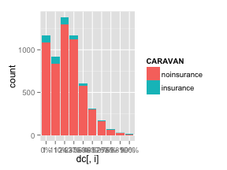 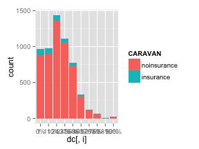       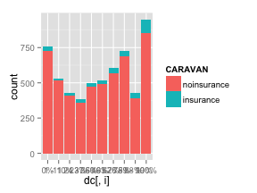 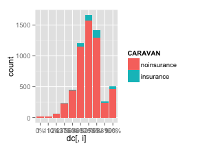 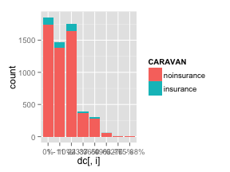           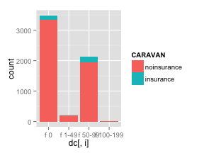 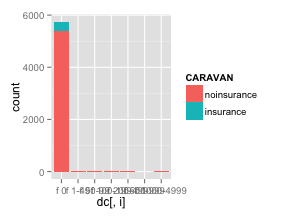 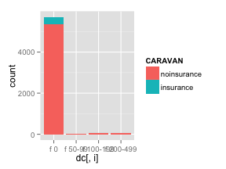 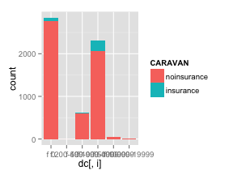  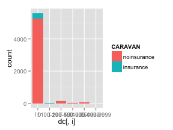  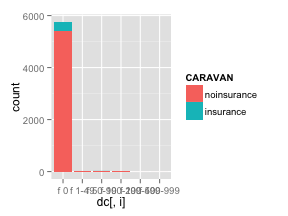   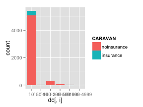 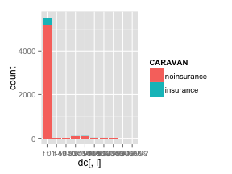  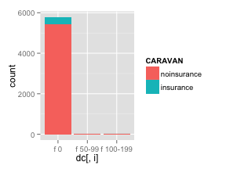   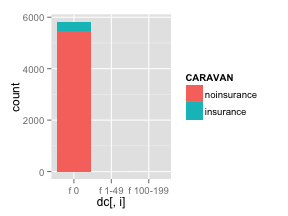        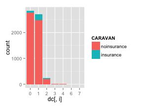  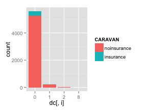   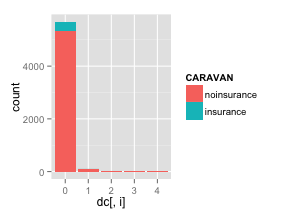 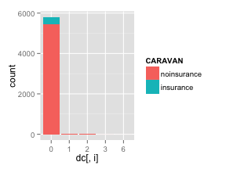 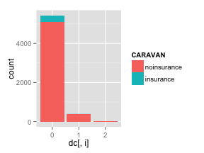 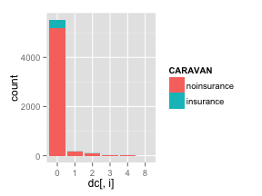 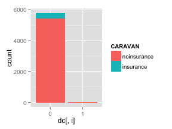 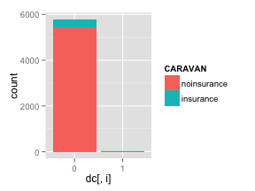  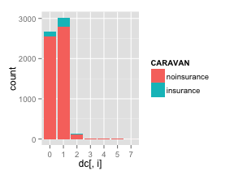 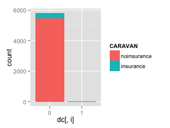     


### Decision Tree EDA

```r
dt <- rpart(CARAVAN ~ ., dc)

summary(dt)
```

```
## Call:
## rpart(formula = CARAVAN ~ ., data = dc)
##   n= 5822 
## 
##   CP nsplit rel error xerror xstd
## 1  0      0         1      0    0
## 
## Node number 1: 5822 observations
##   predicted class=noinsurance  expected loss=0.05977  P(node) =1
##     class counts:  5474   348
##    probabilities: 0.940 0.060
```

```r
printcp(dt)
```

```
## 
## Classification tree:
## rpart(formula = CARAVAN ~ ., data = dc)
## 
## Variables actually used in tree construction:
## character(0)
## 
## Root node error: 348/5822 = 0.06
## 
## n= 5822 
## 
##   CP nsplit rel error xerror xstd
## 1  0      0         1      0    0
```

```r
plotcp(dt)
```

 

```r

plot(dt, uniform = TRUE, main = "Classification Tree for Caravan")
```

```
## Error: fit is not a tree, just a root
```

```r
text(dt, use.n = TRUE, all = TRUE, cex = 0.8)
```

```
## Error: fit is not a tree, just a root
```

It looks like the tree cannot differentiate between the two response classes atm. Will need some way to amplify the signal, perhaps through oversampling.

2.3 Data Selection
------------------
### PCA
_Doesn't work with categorical data_
```{#r}
pca <- princomp(data[1:100,1:5])
```


2.4 Modeling Iter. 1
--------------------
We begin by running the data through multiple algorithms on their respective default settings. This allows us to gather initial information on the performance of the algorithms as well as the dataset itself.
### Split Test/Train

```r
set.seed(123)
mask <- sample(5822, 4075)

train <- dc[mask, ]
test <- dc[-mask, ]
```


### Define Formula
We have to define the formula that we're modeling upon first. We can do this by joining the column names together into a string, and then converting that string into the "formula" object.
```{#r}
y <- names(data)[86]
x <- paste(names(data)[categorical_names], collapse='+')
f <- as.formula(paste(y, x, sep='~'))
```
We now have the formula, shown below:
```{#r}
print(f)
```

### Logistic Regression

```r
lrm <- glm(CARAVAN ~ ., train, family = binomial)
```

```
## Warning: glm.fit: algorithm did not converge
## Warning: glm.fit: fitted probabilities numerically 0 or 1 occurred
```

As seen above, we get a few warnings, one of which informing us that the algorithm didn't converge.

### Decision Tree

```r
dt <- rpart(CARAVAN ~ ., train, method = "class")
printcp(dt)
```

```
## 
## Classification tree:
## rpart(formula = CARAVAN ~ ., data = train, method = "class")
## 
## Variables actually used in tree construction:
## character(0)
## 
## Root node error: 256/4075 = 0.063
## 
## n= 4075 
## 
##   CP nsplit rel error xerror xstd
## 1  0      0         1      0    0
```

No nodes were created and no variables were used...

### Random Forest

```r
rf <- randomForest(CARAVAN ~ ., train)
```

```
## Error: Can not handle categorical predictors with more than 32 categories.
```

Error that it can't handle >32 categories. Convert and try with continuous data instead.

```r
train.numStype <- train
train.numStype$STYPE <- as.numeric(train$STYPE)
rf <- randomForest(CARAVAN ~ ., train.numStype)
rf
```

```
## 
## Call:
##  randomForest(formula = CARAVAN ~ ., data = train.numStype) 
##                Type of random forest: classification
##                      Number of trees: 500
## No. of variables tried at each split: 9
## 
##         OOB estimate of  error rate: 7.41%
## Confusion matrix:
##             noinsurance insurance class.error
## noinsurance        3769        50     0.01309
## insurance           252         4     0.98438
```

It runs now, which is good. However, it only correctly identifies 3 "insurance" observations correctly.

### Naive Bayes
_Unreliable due to independence requirement_

```r
nb <- naiveBayes(CARAVAN ~ ., train)
```


2.5 Modeling Iter. 2
--------------------
We discovered in iteration 1 that the ratio between the classes is just too large. The algorithms will simply settle on 0. We will need to oversample this dataset to even out the obervations between both classes. This way the algorithms will ignore the difference in sample size between the 2.
### Oversample

```r
train.over <- train
table(train.over$CARAVAN)
```

```
## 
## noinsurance   insurance 
##        3819         256
```

Before oversampling, there are 256 "insurance" and 3819 "noinsurance". To make them roughly the same we will repeat the "insurance" observations 14 times.

```r
temp <- train.over[grep("^insurance", train.over$CARAVAN), ]
for (i in 1:14) {
    train.over <- rbind(train.over, temp)
}
table(train.over$CARAVAN)
```

```
## 
## noinsurance   insurance 
##        3819        3840
```

There are now 3840 "insurance" and 3819 "noinsurance". Let's try some of the same models again.

### Logistic Regression

```r
lrm <- glm(CARAVAN ~ ., train.over, family = binomial)
```

```
## Warning: glm.fit: algorithm did not converge
## Warning: glm.fit: fitted probabilities numerically 0 or 1 occurred
```

Still the same errors as before: "algorithm did not converge"

```r
lrm.pred <- predict(lrm, test, type = "response")
```

```
## Error: factor MAANTHUI has new levels 8
```

```r
table(lrm.pred, test$CARAVAN)
```

```
## Error: object 'lrm.pred' not found
```

Nope, not even working.

### Decision Tree

```r
dt <- rpart(CARAVAN ~ ., train.over, method = "class")
printcp(dt)
```

```
## 
## Classification tree:
## rpart(formula = CARAVAN ~ ., data = train.over, method = "class")
## 
## Variables actually used in tree construction:
## [1] MHHUUR   PBRAND   PPERSAUT STYPE   
## 
## Root node error: 3819/7659 = 0.5
## 
## n= 7659 
## 
##      CP nsplit rel error xerror  xstd
## 1 0.371      0      1.00   1.02 0.011
## 2 0.042      1      0.63   0.63 0.011
## 3 0.011      2      0.59   0.58 0.010
## 4 0.010      4      0.56   0.55 0.010
```

Much better this time. 4 variables were used in tree construction this time.

```r
dt.pred <- predict(dt, test, type = "class")
table(dt.pred, test$CARAVAN)
```

```
##              
## dt.pred       noinsurance insurance
##   noinsurance        1130        28
##   insurance           525        64
```

Unfortunately the results still aren't the best. The false negative rate is huge 525/1655 and the false positive rate is 28/92. 

### Random Forest

```r
rf <- randomForest(CARAVAN ~ ., train.over)
```

```
## Error: Can not handle categorical predictors with more than 32 categories.
```

These in-sample results are great! This time the forest was able to correctly identify all of the "insurance" observations (though they are oversampled).

```r
rf.pred <- predict(rf, test)
```

```
## Error: New factor levels not present in the training data
```

```r
table(test$CARAVAN, rf.pred)
```

```
## Error: object 'rf.pred' not found
```

When looking at the test set, unfortunately, the accuracy decreases drastically...

Modeling Iter. 3
----------------
Now that we have the algorithms working due to oversampling, we're running into actual modeling problems. The primary issue we're observing is the large false positive and false negative rates.

### Feature selection via DT EDA
MHHUUR   PBRAND   PPERSAUT STYPE

```r
dt_cols <- c("CARAVAN", "MHHUUR", "PBRAND", "PPERSAUT", "STYPE")
train.dt <- train.over[, dt_cols]
test.dt <- test[, dt_cols]
```


### Logistic Regression

```r
lrm <- glm(CARAVAN ~ ., train.dt, family = binomial)
```

```
## Warning: glm.fit: fitted probabilities numerically 0 or 1 occurred
```

No more "algorithm did not converge" warning.

```r
lrm.pred <- predict(lrm, test.dt)
```

```
## Error: factor PBRAND has new levels f 10000-19999
```

```r
table(lrm.pred, test$CARAVAN)
```

```
## Error: object 'lrm.pred' not found
```

Nope, not even working.

### Decision Tree

```r
dt <- rpart(CARAVAN ~ ., train.dt, method = "class")
printcp(dt)
```

```
## 
## Classification tree:
## rpart(formula = CARAVAN ~ ., data = train.dt, method = "class")
## 
## Variables actually used in tree construction:
## [1] MHHUUR   PBRAND   PPERSAUT STYPE   
## 
## Root node error: 3819/7659 = 0.5
## 
## n= 7659 
## 
##      CP nsplit rel error xerror  xstd
## 1 0.371      0      1.00   1.02 0.011
## 2 0.042      1      0.63   0.63 0.011
## 3 0.012      2      0.59   0.59 0.010
## 4 0.011      5      0.55   0.56 0.010
## 5 0.010      7      0.53   0.54 0.010
```

Much better this time. 4 variables were used in tree construction this time.

```r
dt.pred <- predict(dt, test, type = "class")
table(dt.pred, test$CARAVAN)
```

```
##              
## dt.pred       noinsurance insurance
##   noinsurance        1006        21
##   insurance           649        71
```

Unfortunately the results still aren't the best. The false negative rate is huge 525/1655 and the false positive rate is 28/92. 

### Random Forest

```r
train.dt$STYPE <- as.numeric(train.dt$STYPE)
rf <- randomForest(CARAVAN ~ ., train.dt)
```

These in-sample results are great! This time the forest was able to correctly identify all of the "insurance" observations (though they are oversampled).

```r
test.dt$STYPE <- as.numeric(test.dt$STYPE)
rf.pred <- predict(rf, test.dt)
```

```
## Error: New factor levels not present in the training data
```

```r
table(test$CARAVAN, rf.pred)
```

```
## Error: object 'rf.pred' not found
```

When looking at the test set, unfortunately, the accuracy decreases drastically...
