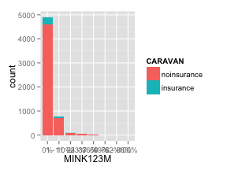
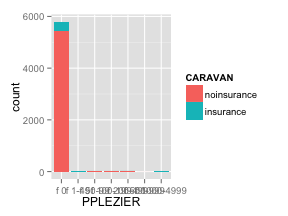

**Setup**

```r
library(kernlab)
# library(car)
library(ggplot2)
library(corrgram)
```

```
## Loading required package: seriation
```

```r
library(vcd)
```

```
## Loading required package: grid
```

```r
library(rpart)
library(randomForest)
```

```
## randomForest 4.6-7
## Type rfNews() to see new features/changes/bug fixes.
```

```r
library(e1071)
library(nnet)
library(MASS)
library(bootstrap)
library(DAAG)
```

```
## Loading required package: lattice
## 
## Attaching package: 'lattice'
## 
## The following object is masked from 'package:seriation':
## 
##     panel.lines
## 
## 
## Attaching package: 'DAAG'
## 
## The following object is masked from 'package:MASS':
## 
##     hills
```


1. Introduction
============


2. Process
=======
2.1 Data Preparation
----------------
### 2.1.1 Import Dataset

```r
data(ticdata)
# raw <- read.csv('../ticdata2000.csv')
data <- ticdata[1:5822, ]
```

### 2.1.2 Modify Datatypes

```r
# categorical_names <- grep('^m|^caravan', names(data)) # not needed for
# kernlab data[,categorical_names] <- lapply(data[,categorical_names],
# as.factor)
dc <- as.data.frame(lapply(data, as.factor))  # transform all to categorical

str(dc)
```

```
## 'data.frame':	5822 obs. of  86 variables:
##  $ STYPE   : Factor w/ 39 levels "Affluent senior apartments",..: 15 20 20 21 11 36 13 15 15 7 ...
##  $ MAANTHUI: Factor w/ 9 levels "1","2","3","4",..: 1 1 1 1 1 1 2 1 1 2 ...
##  $ MGEMOMV : Factor w/ 5 levels "1","2","3","4",..: 3 2 2 3 4 2 3 2 2 3 ...
##  $ MGEMLEEF: Factor w/ 6 levels "20-30","30-40",..: 2 2 2 3 2 1 2 3 4 3 ...
##  $ MOSHOOFD: Factor w/ 10 levels "Average Family",..: 6 6 6 1 7 8 3 6 6 1 ...
##  $ MGODRK  : Ord.factor w/ 10 levels "0%"<"1 - 10%"<..: 1 2 1 3 2 1 3 1 1 4 ...
##  $ MGODPR  : Ord.factor w/ 10 levels "0%"<"1 - 10%"<..: 6 5 5 4 5 6 3 8 2 6 ...
##  $ MGODOV  : Ord.factor w/ 10 levels "0%"<"1 - 10%"<..: 2 2 3 3 2 1 1 1 4 1 ...
##  $ MGODGE  : Ord.factor w/ 10 levels "0%"<"1 - 10%"<..: 4 5 5 5 5 6 6 3 7 3 ...
##  $ MRELGE  : Ord.factor w/ 10 levels "0%"<"1 - 10%"<..: 8 7 4 6 8 1 8 8 7 8 ...
##  $ MRELSA  : Ord.factor w/ 10 levels "0%"<"1 - 10%"<..: 1 3 3 3 2 7 3 3 1 1 ...
##  $ MRELOV  : Ord.factor w/ 10 levels "0%"<"1 - 10%"<..: 3 3 5 3 3 4 1 1 4 3 ...
##  $ MFALLEEN: Ord.factor w/ 10 levels "0%"<"1 - 10%"<..: 2 1 5 3 3 4 1 1 4 3 ...
##  $ MFGEKIND: Ord.factor w/ 10 levels "0%"<"1 - 10%"<..: 3 5 5 4 5 6 4 6 4 3 ...
##  $ MFWEKIND: Ord.factor w/ 10 levels "0%"<"1 - 10%"<..: 7 6 3 5 5 3 7 5 4 7 ...
##  $ MOPLHOOG: Ord.factor w/ 10 levels "0%"<"1 - 10%"<..: 2 1 1 4 6 1 1 1 1 1 ...
##  $ MOPLMIDD: Ord.factor w/ 10 levels "0%"<"1 - 10%"<..: 3 6 6 5 5 6 5 4 2 5 ...
##  $ MOPLLAAG: Ord.factor w/ 10 levels "0%"<"1 - 10%"<..: 8 5 5 3 1 5 6 7 9 6 ...
##  $ MBERHOOG: Ord.factor w/ 10 levels "0%"<"1 - 10%"<..: 2 1 1 5 1 3 1 3 2 3 ...
##  $ MBERZELF: Ord.factor w/ 10 levels "0%"<"1 - 10%"<..: 1 1 1 1 6 1 1 1 2 1 ...
##  $ MBERBOER: Ord.factor w/ 10 levels "0%"<"1 - 10%"<..: 2 1 1 1 5 1 1 1 1 1 ...
##  $ MBERMIDD: Ord.factor w/ 10 levels "0%"<"1 - 10%"<..: 3 6 8 4 1 5 5 3 2 4 ...
##  $ MBERARBG: Ord.factor w/ 10 levels "0%"<"1 - 10%"<..: 6 1 1 2 1 3 2 6 9 4 ...
##  $ MBERARBO: Ord.factor w/ 10 levels "0%"<"1 - 10%"<..: 3 5 3 3 1 3 6 3 2 4 ...
##  $ MSKA    : Ord.factor w/ 10 levels "0%"<"1 - 10%"<..: 2 1 1 4 10 3 1 3 2 2 ...
##  $ MSKB1   : Ord.factor w/ 10 levels "0%"<"1 - 10%"<..: 2 3 6 3 1 3 2 2 2 3 ...
##  $ MSKB2   : Ord.factor w/ 10 levels "0%"<"1 - 10%"<..: 3 4 1 2 1 3 5 3 1 2 ...
##  $ MSKC    : Ord.factor w/ 10 levels "0%"<"1 - 10%"<..: 7 6 5 5 1 5 6 6 9 5 ...
##  $ MSKD    : Ord.factor w/ 10 levels "0%"<"1 - 10%"<..: 2 1 1 1 1 3 1 3 2 3 ...
##  $ MHHUUR  : Ord.factor w/ 10 levels "0%"<"1 - 10%"<..: 2 3 8 6 5 10 7 1 10 1 ...
##  $ MHKOOP  : Ord.factor w/ 10 levels "0%"<"1 - 10%"<..: 9 8 3 5 6 1 4 10 1 10 ...
##  $ MAUT1   : Ord.factor w/ 10 levels "0%"<"1 - 10%"<..: 9 8 8 10 7 6 9 5 6 7 ...
##  $ MAUT2   : Ord.factor w/ 10 levels "0%"<"1 - 10%"<..: 1 2 1 1 3 4 1 5 3 2 ...
##  $ MAUT0   : Ord.factor w/ 10 levels "0%"<"1 - 10%"<..: 2 3 3 1 2 4 2 3 4 3 ...
##  $ MZFONDS : Ord.factor w/ 10 levels "0%"<"1 - 10%"<..: 9 7 10 8 6 10 10 7 8 7 ...
##  $ MZPART  : Ord.factor w/ 10 levels "0%"<"1 - 10%"<..: 2 4 1 3 5 1 1 4 3 4 ...
##  $ MINKM30 : Ord.factor w/ 10 levels "0%"<"1 - 10%"<..: 1 3 5 2 1 6 5 3 8 3 ...
##  $ MINK3045: Ord.factor w/ 10 levels "0%"<"1 - 10%"<..: 5 1 6 6 1 3 4 6 3 4 ...
##  $ MINK4575: Ord.factor w/ 10 levels "0%"<"1 - 10%"<..: 6 6 1 4 10 4 4 4 2 4 ...
##  $ MINK7512: Ord.factor w/ 10 levels "0%"<"1 - 10%"<..: 1 3 1 1 1 1 1 1 1 2 ...
##  $ MINK123M: Ord.factor w/ 10 levels "0%"<"1 - 10%"<..: 1 1 1 1 1 1 1 1 1 1 ...
##  $ MINKGEM : Ord.factor w/ 10 levels "0%"<"1 - 10%"<..: 5 6 4 5 7 4 4 4 3 5 ...
##  $ MKOOPKLA: Ord.factor w/ 10 levels "0%"<"1 - 10%"<..: 4 5 5 5 4 4 6 4 4 8 ...
##  $ PWAPART : Ord.factor w/ 10 levels "f 0"<"f 1-49"<..: 1 3 3 1 1 1 1 1 1 3 ...
##  $ PWABEDR : Ord.factor w/ 10 levels "f 0"<"f 1-49"<..: 1 1 1 1 1 1 1 1 1 1 ...
##  $ PWALAND : Ord.factor w/ 10 levels "f 0"<"f 1-49"<..: 1 1 1 1 1 1 1 1 1 1 ...
##  $ PPERSAUT: Ord.factor w/ 10 levels "f 0"<"f 1-49"<..: 7 1 7 7 1 7 7 1 6 1 ...
##  $ PBESAUT : Ord.factor w/ 10 levels "f 0"<"f 1-49"<..: 1 1 1 1 1 1 1 1 1 1 ...
##  $ PMOTSCO : Ord.factor w/ 10 levels "f 0"<"f 1-49"<..: 1 1 1 1 1 1 1 1 1 1 ...
##  $ AAUT    : Ord.factor w/ 10 levels "f 0"<"f 1-49"<..: 1 1 1 1 1 1 1 1 1 1 ...
##  $ PAANHANG: Ord.factor w/ 10 levels "f 0"<"f 1-49"<..: 1 1 1 1 1 1 1 1 1 1 ...
##  $ PTRACTOR: Ord.factor w/ 10 levels "f 0"<"f 1-49"<..: 1 1 1 1 1 1 1 1 1 1 ...
##  $ PWERKT  : Ord.factor w/ 10 levels "f 0"<"f 1-49"<..: 1 1 1 1 1 1 1 1 1 1 ...
##  $ PBROM   : Ord.factor w/ 10 levels "f 0"<"f 1-49"<..: 1 1 1 1 1 1 1 4 1 1 ...
##  $ PLEVEN  : Ord.factor w/ 10 levels "f 0"<"f 1-49"<..: 1 1 1 1 1 1 1 1 1 1 ...
##  $ PPERSONG: Ord.factor w/ 10 levels "f 0"<"f 1-49"<..: 1 1 1 1 1 1 1 1 1 1 ...
##  $ PGEZONG : Ord.factor w/ 10 levels "f 0"<"f 1-49"<..: 1 1 1 1 1 1 1 1 1 1 ...
##  $ PWAOREG : Ord.factor w/ 10 levels "f 0"<"f 1-49"<..: 1 1 1 1 1 1 1 1 1 1 ...
##  $ PBRAND  : Ord.factor w/ 10 levels "f 0"<"f 1-49"<..: 6 3 3 3 7 1 1 1 1 4 ...
##  $ PZEILPL : Ord.factor w/ 10 levels "f 0"<"f 1-49"<..: 1 1 1 1 1 1 1 1 1 1 ...
##  $ PPLEZIER: Ord.factor w/ 10 levels "f 0"<"f 1-49"<..: 1 1 1 1 1 1 1 1 1 1 ...
##  $ PFIETS  : Ord.factor w/ 10 levels "f 0"<"f 1-49"<..: 1 1 1 1 1 1 1 1 1 1 ...
##  $ PINBOED : Ord.factor w/ 10 levels "f 0"<"f 1-49"<..: 1 1 1 1 1 1 1 1 1 1 ...
##  $ PBYSTAND: Ord.factor w/ 10 levels "f 0"<"f 1-49"<..: 1 1 1 1 1 1 1 1 1 1 ...
##  $ AWAPART : Factor w/ 3 levels "0","1","2": 1 3 2 1 1 1 1 1 1 2 ...
##  $ AWABEDR : Factor w/ 3 levels "0","1","5": 1 1 1 1 1 1 1 1 1 1 ...
##  $ AWALAND : Factor w/ 2 levels "0","1": 1 1 1 1 1 1 1 1 1 1 ...
##  $ APERSAUT: Factor w/ 7 levels "0","1","2","3",..: 2 1 2 2 1 2 2 1 2 1 ...
##  $ ABESAUT : Factor w/ 5 levels "0","1","2","3",..: 1 1 1 1 1 1 1 1 1 1 ...
##  $ AMOTSCO : Factor w/ 4 levels "0","1","2","8": 1 1 1 1 1 1 1 1 1 1 ...
##  $ AVRAAUT : Factor w/ 4 levels "0","1","2","3": 1 1 1 1 1 1 1 1 1 1 ...
##  $ AAANHANG: Factor w/ 4 levels "0","1","2","3": 1 1 1 1 1 1 1 1 1 1 ...
##  $ ATRACTOR: Factor w/ 5 levels "0","1","2","3",..: 1 1 1 1 1 1 1 1 1 1 ...
##  $ AWERKT  : Factor w/ 5 levels "0","1","2","3",..: 1 1 1 1 1 1 1 1 1 1 ...
##  $ ABROM   : Factor w/ 3 levels "0","1","2": 1 1 1 1 1 1 1 2 1 1 ...
##  $ ALEVEN  : Factor w/ 6 levels "0","1","2","3",..: 1 1 1 1 1 1 1 1 1 1 ...
##  $ APERSONG: Factor w/ 2 levels "0","1": 1 1 1 1 1 1 1 1 1 1 ...
##  $ AGEZONG : Factor w/ 2 levels "0","1": 1 1 1 1 1 1 1 1 1 1 ...
##  $ AWAOREG : Factor w/ 3 levels "0","1","2": 1 1 1 1 1 1 1 1 1 1 ...
##  $ ABRAND  : Factor w/ 7 levels "0","1","2","3",..: 2 2 2 2 2 1 1 1 1 2 ...
##  $ AZEILPL : Factor w/ 2 levels "0","1": 1 1 1 1 1 1 1 1 1 1 ...
##  $ APLEZIER: Factor w/ 3 levels "0","1","2": 1 1 1 1 1 1 1 1 1 1 ...
##  $ AFIETS  : Factor w/ 4 levels "0","1","2","3": 1 1 1 1 1 1 1 1 1 1 ...
##  $ AINBOED : Factor w/ 3 levels "0","1","2": 1 1 1 1 1 1 1 1 1 1 ...
##  $ ABYSTAND: Factor w/ 3 levels "0","1","2": 1 1 1 1 1 1 1 1 1 1 ...
##  $ CARAVAN : Factor w/ 2 levels "noinsurance",..: 1 1 1 1 1 1 1 1 1 1 ...
```

```r
head(dc)
```

```
##                        STYPE MAANTHUI MGEMOMV MGEMLEEF
## 1 Lower class large families        1       3    30-40
## 2  Mixed small town dwellers        1       2    30-40
## 3  Mixed small town dwellers        1       2    30-40
## 4  Modern, complete families        1       3    40-50
## 5         Large family farms        1       4    30-40
## 6           Young and rising        1       2    20-30
##                MOSHOOFD   MGODRK   MGODPR   MGODOV   MGODGE   MRELGE
## 1 Family with grown ups       0% 50 - 62%  1 - 10% 24 - 36% 76 - 88%
## 2 Family with grown ups  1 - 10% 37 - 49%  1 - 10% 37 - 49% 63 - 75%
## 3 Family with grown ups       0% 37 - 49% 11 - 23% 37 - 49% 24 - 36%
## 4        Average Family 11 - 23% 24 - 36% 11 - 23% 37 - 49% 50 - 62%
## 5               Farmers  1 - 10% 37 - 49%  1 - 10% 37 - 49% 76 - 88%
## 6           Living well       0% 50 - 62%       0% 50 - 62%       0%
##     MRELSA   MRELOV MFALLEEN MFGEKIND MFWEKIND MOPLHOOG MOPLMIDD MOPLLAAG
## 1       0% 11 - 23%  1 - 10% 11 - 23% 63 - 75%  1 - 10% 11 - 23% 76 - 88%
## 2 11 - 23% 11 - 23%       0% 37 - 49% 50 - 62%       0% 50 - 62% 37 - 49%
## 3 11 - 23% 37 - 49% 37 - 49% 37 - 49% 11 - 23%       0% 50 - 62% 37 - 49%
## 4 11 - 23% 11 - 23% 11 - 23% 24 - 36% 37 - 49% 24 - 36% 37 - 49% 11 - 23%
## 5  1 - 10% 11 - 23% 11 - 23% 37 - 49% 37 - 49% 50 - 62% 37 - 49%       0%
## 6 63 - 75% 24 - 36% 24 - 36% 50 - 62% 11 - 23%       0% 50 - 62% 37 - 49%
##   MBERHOOG MBERZELF MBERBOER MBERMIDD MBERARBG MBERARBO     MSKA    MSKB1
## 1  1 - 10%       0%  1 - 10% 11 - 23% 50 - 62% 11 - 23%  1 - 10%  1 - 10%
## 2       0%       0%       0% 50 - 62%       0% 37 - 49%       0% 11 - 23%
## 3       0%       0%       0% 76 - 88%       0% 11 - 23%       0% 50 - 62%
## 4 37 - 49%       0%       0% 24 - 36%  1 - 10% 11 - 23% 24 - 36% 11 - 23%
## 5       0% 50 - 62% 37 - 49%       0%       0%       0%     100%       0%
## 6 11 - 23%       0%       0% 37 - 49% 11 - 23% 11 - 23% 11 - 23% 11 - 23%
##      MSKB2     MSKC     MSKD   MHHUUR   MHKOOP    MAUT1    MAUT2    MAUT0
## 1 11 - 23% 63 - 75%  1 - 10%  1 - 10% 89 - 99% 89 - 99%       0%  1 - 10%
## 2 24 - 36% 50 - 62%       0% 11 - 23% 76 - 88% 76 - 88%  1 - 10% 11 - 23%
## 3       0% 37 - 49%       0% 76 - 88% 11 - 23% 76 - 88%       0% 11 - 23%
## 4  1 - 10% 37 - 49%       0% 50 - 62% 37 - 49%     100%       0%       0%
## 5       0%       0%       0% 37 - 49% 50 - 62% 63 - 75% 11 - 23%  1 - 10%
## 6 11 - 23% 37 - 49% 11 - 23%     100%       0% 50 - 62% 24 - 36% 24 - 36%
##    MZFONDS   MZPART  MINKM30 MINK3045 MINK4575 MINK7512 MINK123M  MINKGEM
## 1 89 - 99%  1 - 10%       0% 37 - 49% 50 - 62%       0%       0% 37 - 49%
## 2 63 - 75% 24 - 36% 11 - 23%       0% 50 - 62% 11 - 23%       0% 50 - 62%
## 3     100%       0% 37 - 49% 50 - 62%       0%       0%       0% 24 - 36%
## 4 76 - 88% 11 - 23%  1 - 10% 50 - 62% 24 - 36%       0%       0% 37 - 49%
## 5 50 - 62% 37 - 49%       0%       0%     100%       0%       0% 63 - 75%
## 6     100%       0% 50 - 62% 11 - 23% 24 - 36%       0%       0% 24 - 36%
##   MKOOPKLA PWAPART PWABEDR PWALAND    PPERSAUT PBESAUT PMOTSCO AAUT
## 1 24 - 36%     f 0     f 0     f 0 f 1000-4999     f 0     f 0  f 0
## 2 37 - 49% f 50-99     f 0     f 0         f 0     f 0     f 0  f 0
## 3 37 - 49% f 50-99     f 0     f 0 f 1000-4999     f 0     f 0  f 0
## 4 37 - 49%     f 0     f 0     f 0 f 1000-4999     f 0     f 0  f 0
## 5 24 - 36%     f 0     f 0     f 0         f 0     f 0     f 0  f 0
## 6 24 - 36%     f 0     f 0     f 0 f 1000-4999     f 0     f 0  f 0
##   PAANHANG PTRACTOR PWERKT PBROM PLEVEN PPERSONG PGEZONG PWAOREG
## 1      f 0      f 0    f 0   f 0    f 0      f 0     f 0     f 0
## 2      f 0      f 0    f 0   f 0    f 0      f 0     f 0     f 0
## 3      f 0      f 0    f 0   f 0    f 0      f 0     f 0     f 0
## 4      f 0      f 0    f 0   f 0    f 0      f 0     f 0     f 0
## 5      f 0      f 0    f 0   f 0    f 0      f 0     f 0     f 0
## 6      f 0      f 0    f 0   f 0    f 0      f 0     f 0     f 0
##        PBRAND PZEILPL PPLEZIER PFIETS PINBOED PBYSTAND AWAPART AWABEDR
## 1   f 500-999     f 0      f 0    f 0     f 0      f 0       0       0
## 2     f 50-99     f 0      f 0    f 0     f 0      f 0       2       0
## 3     f 50-99     f 0      f 0    f 0     f 0      f 0       1       0
## 4     f 50-99     f 0      f 0    f 0     f 0      f 0       0       0
## 5 f 1000-4999     f 0      f 0    f 0     f 0      f 0       0       0
## 6         f 0     f 0      f 0    f 0     f 0      f 0       0       0
##   AWALAND APERSAUT ABESAUT AMOTSCO AVRAAUT AAANHANG ATRACTOR AWERKT ABROM
## 1       0        1       0       0       0        0        0      0     0
## 2       0        0       0       0       0        0        0      0     0
## 3       0        1       0       0       0        0        0      0     0
## 4       0        1       0       0       0        0        0      0     0
## 5       0        0       0       0       0        0        0      0     0
## 6       0        1       0       0       0        0        0      0     0
##   ALEVEN APERSONG AGEZONG AWAOREG ABRAND AZEILPL APLEZIER AFIETS AINBOED
## 1      0        0       0       0      1       0        0      0       0
## 2      0        0       0       0      1       0        0      0       0
## 3      0        0       0       0      1       0        0      0       0
## 4      0        0       0       0      1       0        0      0       0
## 5      0        0       0       0      1       0        0      0       0
## 6      0        0       0       0      0       0        0      0       0
##   ABYSTAND     CARAVAN
## 1        0 noinsurance
## 2        0 noinsurance
## 3        0 noinsurance
## 4        0 noinsurance
## 5        0 noinsurance
## 6        0 noinsurance
```


2.2 Data Exploration
----------------
### 2.2.1 Summary EDA
```{.r}
summary(dc)
```

### 2.2.2 Univariate EDA

### Multivariate EDA: Explanatory vs Reponse
#### Bar Plots

```r
for (i in 1:85) {
    p <- ggplot(dc, aes(x = dc[, i], fill = CARAVAN)) + geom_bar() + labs(x = names(dc)[i])
    print(p)
}
```

                                                                                     


#### Corrgram
_Works with continuous variables_
```{#r}
corrgram(dc[1:5,])
```
#### Association Plot
_Works with categorical variables_
_Paused for the time being to increase speed_
```{.r, fig.width=4, fig.height=4}
for(i in 1:85){
  t <- table(dc[,c(i, 86)])
  assoc(t, shade=T)
}
```

### Decision Tree EDA
```{.r, fig.width=10, fig.height=10}
dt <- rpart(CARAVAN~., dc)

summary(dt)
printcp(dt)
plotcp(dt)

plot(dt, uniform=TRUE, main="Classification Tree for Caravan")
text(dt, use.n=TRUE, all=TRUE, cex=0.8)
```
It looks like the tree cannot differentiate between the two response classes atm. Will need some way to amplify the signal, perhaps through oversampling.

2.3 Data Selection
------------------
### PCA
_Doesn't work with categorical data_
```{#r}
pca <- princomp(data[1:100,1:5])
```


2.4 Modeling Iter. 1
--------------------
We begin by running the data through multiple algorithms on their respective default settings. This allows us to gather initial information on the performance of the algorithms as well as the dataset itself.
### Split Test/Train
```{.r}
set.seed(123)
mask <- sample(5822,4075)

train <- dc[mask,]
test <- dc[-mask,]
```

### Define Formula
We have to define the formula that we're modeling upon first. We can do this by joining the column names together into a string, and then converting that string into the "formula" object.
```{#r}
y <- names(data)[86]
x <- paste(names(data)[categorical_names], collapse='+')
f <- as.formula(paste(y, x, sep='~'))
```
We now have the formula, shown below:
```{#r}
print(f)
```

### Logistic Regression
```{.r}
lrm <- glm(CARAVAN~., train, family=binomial)
lrm.pred <- predict(lrm, test)
```
As seen above, we get a few warnings, one of which informing us that the algorithm didn't converge. None of these warnings are fatal so we move on with the prediction phase to see what happens. However, we see here that for **some variables the classes used in training are not present in the test set**. Unfortunately this is a fatal error so we will have to move on.

_We did convert some of variables to numeric but after a certain point this defeats the premise of the original conversion._

### Decision Tree
```{.r}
dt <- rpart(CARAVAN~., train, method='class')
printcp(dt)
```
No nodes were created and no variables were used...

### Random Forest
```{.r}
rf <- randomForest(CARAVAN~., train)
```
Error that it can't handle >32 categories. Convert and try with continuous data instead.
```{.r}
train.temp <- train
train.temp$STYPE <- as.numeric(train.temp$STYPE)
rf <- randomForest(CARAVAN~., train.temp)
rf
```
It runs now, which is good. However, it only correctly identifies 3 "insurance" observations correctly (in-sample). Let's try out-of-sample instead and see how the model fares.
```{.r}
test.temp <- test
test.temp$STYPE <- as.numeric(test.temp$STYPE)
rf.pred <- predict(rf, test.temp)
table(test$CARAVAN, rf.pred)
```
Unfortunately the model doesn't do well against the test data either. 

### Naive Bayes
_Unreliable due to independence requirement. Skipping._
```{#r}
nb <- naiveBayes(CARAVAN~., train)
```

### Neural Net
```{.r}
nn <- nnet(CARAVAN~., train, size=1)
nn.pred <- predict(nn, test, type='class')
table(test$CARAVAN, nn.pred)
```
The neural has predicted all the test observations to be 'noinsurance'. This is probably due to the difference in class counts in the observations.

### Summary
None of the techniques used in this iteration provided satisfactory results. To sum up the findings:
- Logistic Regression
  - Returned warnings, plus the nature of the model requires the same dummy variables in both training and testing. This was not the case.
- Decision Tree:
  - Nodes weren't even created. Probably due to the large skew of the CARAVAN class.
- Random Forest
  - Horrible accuracy.
- Neural Net
  - Did not assign a single observation to 'insurance'. 


2.5 Modeling Iter. 2
--------------------
We discovered in iteration 1 that the ratio between the classes is just too large. The algorithms will simply settle on 0. We will need to oversample this dataset to even out the obervations between both classes. This way the algorithms will ignore the difference in sample size between the 2.
### Oversample
```{.r}
train.over <- train
table(train.over$CARAVAN)
```
Before oversampling, there are 256 "insurance" and 3819 "noinsurance". To make them roughly the same we will repeat the "insurance" observations 14 times.
```{.r}
temp <- train.over[grep('^insurance', train.over$CARAVAN),]
for(i in 1:14){
  train.over <- rbind(train.over, temp)
}
table(train.over$CARAVAN)
```
There are now 3840 "insurance" and 3819 "noinsurance". Let's try some of the same models again.

### Logistic Regression
```{.r}
lrm <- glm(CARAVAN~., train.over, family=binomial)
```
Still the same errors as before: "algorithm did not converge"
```{.r}
lrm.pred <- predict(lrm, test, type='response')
table(lrm.pred, test$CARAVAN)
```
Nope, not even working.

### Decision Tree
```{.r}
dt <- rpart(CARAVAN~., train.over, method='class')
printcp(dt)
```
Much better this time. 4 variables were used in tree construction this time.
```{.r}
dt.pred <- predict(dt, test, type='class')
table(dt.pred, test$CARAVAN)
```
Unfortunately the results still aren't the best. The false negative rate is huge 525/1655 and the false positive rate is 28/92. 

### Random Forest
```{.r}
train.temp <- train.over
train.temp$STYPE <- as.numeric(train.temp$STYPE)
rf <- randomForest(CARAVAN~., train.temp)
rf
```
These in-sample results are great! This time the forest was able to correctly identify all of the "insurance" observations (though they are oversampled).
```{.r}
test.temp <- test
test.temp$STYPE <- as.numeric(test.temp$STYPE)
rf.pred <- predict(rf, test.temp)
table(test$CARAVAN, rf.pred)
```
When looking at the test set, unfortunately, the out-of-samply accuracy decreases drastically...

### Neural Net
```{.r}
system.time(nn <- nnet(CARAVAN~., train.over, size=1))
nn.pred <- predict(nn, test, type='class')
table(test$CARAVAN, nn.pred)
```


Modeling Iter. 3
----------------
Now that we have the algorithms working due to oversampling, we're running into actual modeling problems. The primary issue we're observing is the large false positive and false negative rates.

### Feature selection via DT EDA
MHHUUR   PBRAND   PPERSAUT STYPE
```{.r}
dt_cols <- c('CARAVAN', 'MHHUUR', 'PPERSAUT', 'STYPE')
train.dt <- train.over[, dt_cols]
test.dt <- test[, dt_cols]
```

### Logistic Regression
```{.r}
lrm <- glm(CARAVAN~., train.dt, family=binomial)
```
No more "algorithm did not converge" warning.
```{.r}
lrm.pred <- predict(lrm, test.dt)
lrm.pred <- 1*(lrm.pred >= 0.5)
table(lrm.pred, test$CARAVAN)
```
Working, but not that great.

### Decision Tree
```{.r}
dt <- rpart(CARAVAN~., train.dt, method='class')
printcp(dt)
```
Not surprisingly, the DT still works and uses all four of the variables we selected out.
```{.r}
dt.pred <- predict(dt, test, type='class')
table(dt.pred, test$CARAVAN)
```
And also not too surprisingly, the results are a bit worse give we removed a ton of information. The false negative rate is now a huge 649/1655 and the false positive rate is 21/92. 

### Random Forest
```{.r}
train.temp <- train.dt
train.temp$STYPE <- as.numeric(train.temp$STYPE)
rf <- randomForest(CARAVAN~., train.temp)
rf
```

```{.r}
test.temp <- test.dt
test.temp$STYPE <- as.numeric(test.temp$STYPE)
rf.pred <- predict(rf, test.temp)
table(test$CARAVAN, rf.pred)
```

### Summary
It looks like doing a feature selection through decision tree EDA just isn't that great. Let's explore some other FS techniques.


Modeling Iter. 4
----------------
First, let's explore undersampling.
While oversampling did balance our dataset out enough to enable actual modeling, undersampling may be better due to the underlying methodology. Instead of producing fake date we will randomly sample the 'noinsurance' class to even out the balance.
### Undersample
```{.r}
train.under <- train
table(train.under$CARAVAN)
```
Like before, we start off with there are 256 "insurance" and 3819 "noinsurance". To make this balanced we will randomly sample 256 "noinsurance" observations.
```{.r}
mask <- sample(3819, 256)
temp <- subset(train.under, CARAVAN %in% 'noinsurance')
temp <- temp[mask,]
train.under <- rbind(temp, subset(train.under, CARAVAN %in% 'insurance'))

table(train.under$CARAVAN)
```
There are now 256 "insurance" and 256 "noinsurance". Let's try some of the same models again.

IGNORE
The truncating of the dataset has **cut down observations of classes within some variables#**. This means that we will have to redo the factors inside the dataset.
/IGNORE


### Logistic Regression
```{.r}
lrm <- glm(CARAVAN~., train.under, family=binomial)
```
New error this time: contrasts can be applied only to factors with 2 or more levels
This means that we've cut down too much data for the logistic regression to actually process... Let's try something else for now.

### Decision Tree
```{.r}
dt <- rpart(CARAVAN~., train.under, method='class')
printcp(dt)
```
The model actually produced results this time. Let's test it.
```{.r}
dt.pred <- predict(dt, test, type='class')
table(dt.pred, test$CARAVAN)
```
These results are comparable to the oversampling trial before.. The false negative rate is huge 641/1655 and the false positive rate is 28/92. 

### Random Forest
```{.}
train.temp <- train.under
train.temp$STYPE <- as.numeric(train.temp$STYPE)
rf <- randomForest(CARAVAN~., train.temp)
rf
```
Not the best
```{.r}
test.temp <- test
test.temp$STYPE <- as.numeric(test.temp$STYPE)
rf.pred <- predict(rf, test.temp)
table(test$CARAVAN, rf.pred)
```
When looking at the test set, unfortunately, the out-of-samply accuracy decreases drastically...

### Neural Net
```{.r}
system.time(nn <- nnet(CARAVAN~., train.under, size=1))
nn.pred <- predict(nn, test, type='class')
table(test$CARAVAN, nn.pred)
```
Runs drastically faster, which isn't surprising. The algorithm also **returns only "insurance" classes** for entirety of the test set. It seems the undersampling did not work for NN.

### Summary
Recommend tossing train.under dataset. With just 512 observations there's just too much information lost.


Modeling Iter. 5
----------------
Feature selection
Continue with oversampled set

### Stepwise Regression
```{.r}
lrm <- glm(CARAVAN~., train, family=binomial)
step <- stepAIC(lrm, directions='both')
```
This takes forever...

### Manual
```{.r}
lrm1 <- glm(CARAVAN~STYPE, train.over, family=binomial)
lrm2 <- glm(CARAVAN~MAANTHUI, train.over, family=binomial)
anova(lrm1, lrm2)
```


Other Tasks
-----------
Cross Validation: may help with the skew of the target classe
Indicator Binning: to solve the Curse of Dimensionality


