**Setup**

```r
library(kernlab)
# library(car)
library(ggplot2)
library(corrgram)
```

```
## Loading required package: seriation
```

```r
library(vcd)
```

```
## Loading required package: grid
```

```r
library(rpart)
library(randomForest)
```

```
## randomForest 4.6-7
## Type rfNews() to see new features/changes/bug fixes.
```

```r
library(e1071)
library(nnet)
library(MASS)
library(bootstrap)
library(DAAG)
```

```
## Loading required package: lattice
## 
## Attaching package: 'lattice'
## 
## The following object is masked from 'package:seriation':
## 
##     panel.lines
## 
## 
## Attaching package: 'DAAG'
## 
## The following object is masked from 'package:MASS':
## 
##     hills
```


### 2.1.1 Import Dataset

```r
data(ticdata)
# raw <- read.csv('../ticdata2000.csv')
data <- ticdata[1:5822, ]
```


#### Association Plot (Original Categ. Vars.)
_Works with categorical variables_
_Paused for the time being to increase speed_

```r
for (i in 1:64) {
    t <- table(data[, c(i, 86)])
    assoc(t, shade = T)
}
```

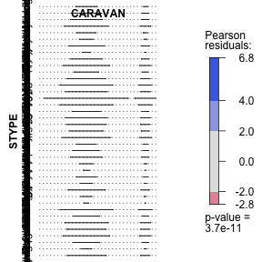 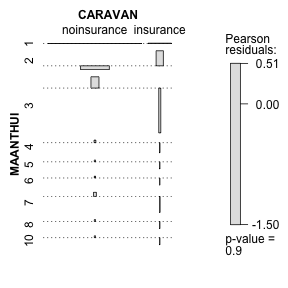 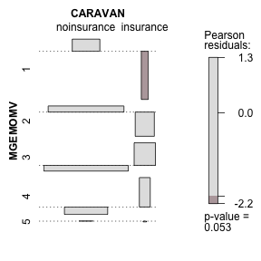 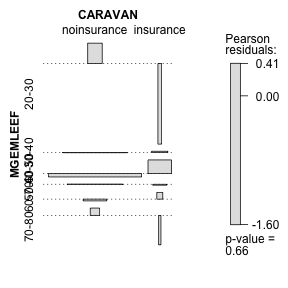 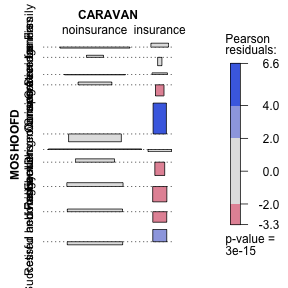 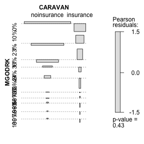 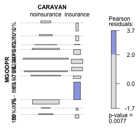 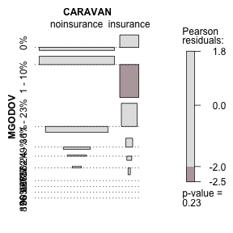 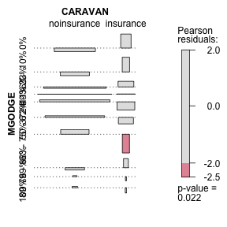 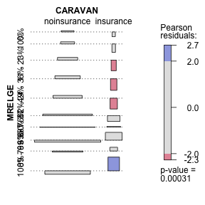  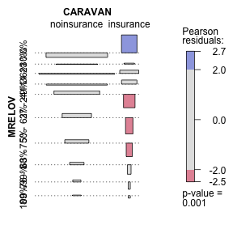 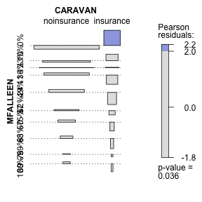 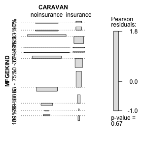 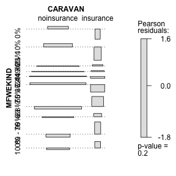 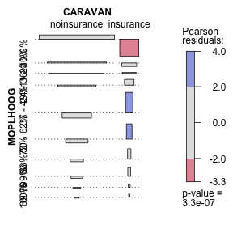 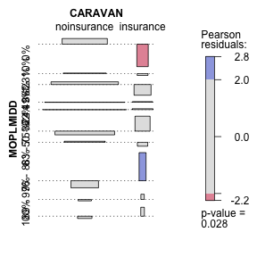 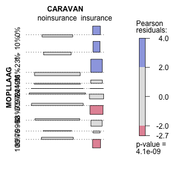 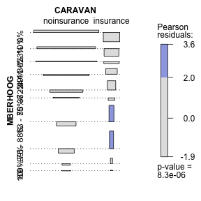 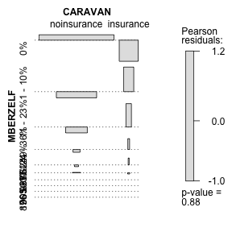 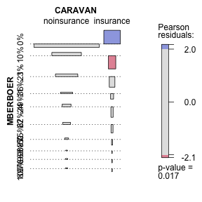 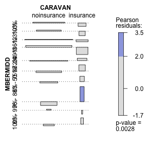 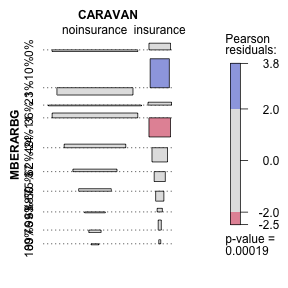 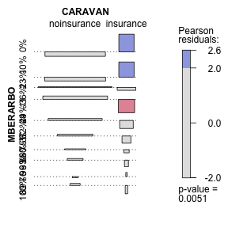 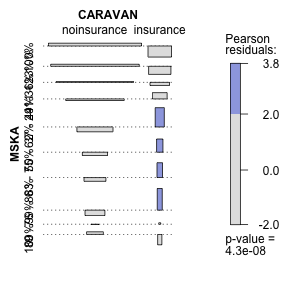  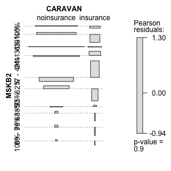 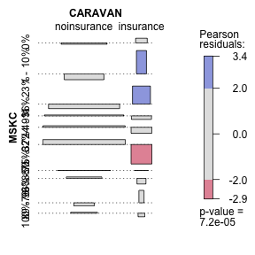 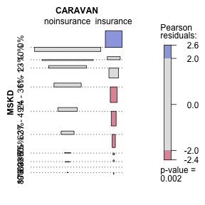 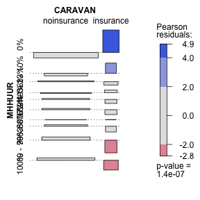 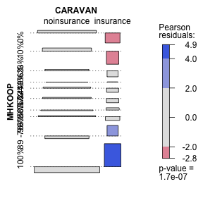 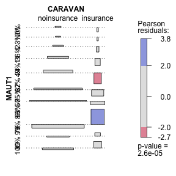 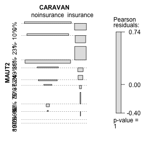 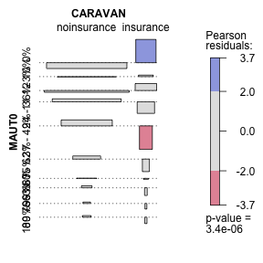 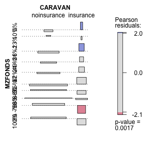 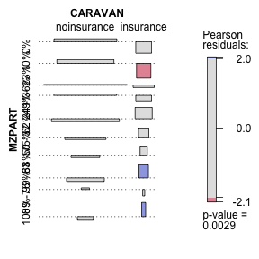 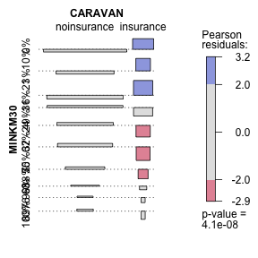 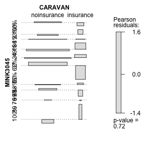 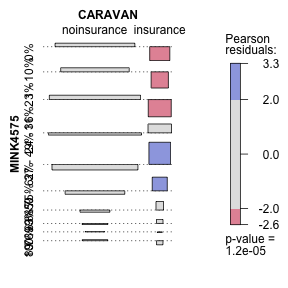 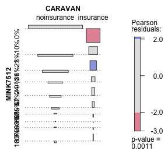 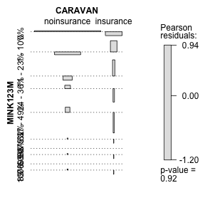 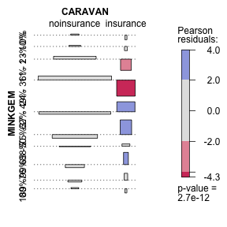 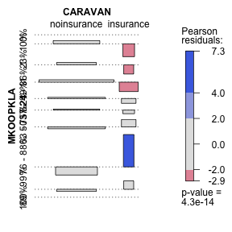 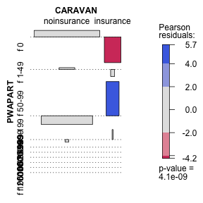 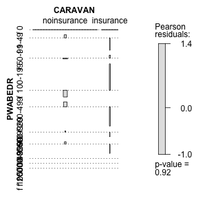 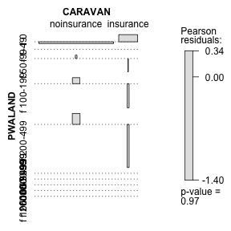 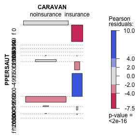 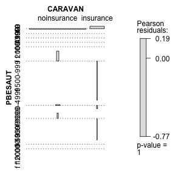 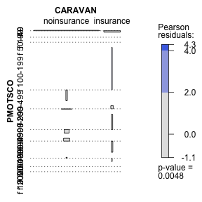 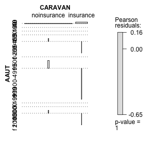  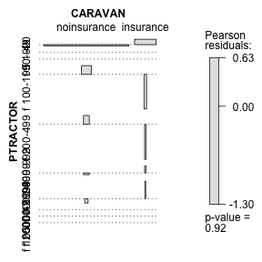 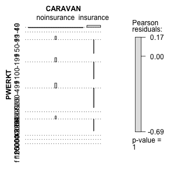            


#### Bar Plots (Original Categ. Vars.)

```r
for (i in 1:64) {
    p <- ggplot(data, aes(x = data[, i], fill = CARAVAN)) + geom_bar() + labs(x = names(data)[i])
    print(p)
}
```

 

```
## stat_bin: binwidth defaulted to range/30. Use 'binwidth = x' to adjust this.
```

 

```
## stat_bin: binwidth defaulted to range/30. Use 'binwidth = x' to adjust this.
```

                                                              


#### Box/whisker Plot (Original Num. Vars.)

```r
for (i in 65:85) {
    formula.string <- paste(names(data)[i], "CARAVAN", sep = "~")
    f <- as.formula(formula.string)
    boxplot(f, data, main = names(data)[i])
}
```

                     


#### Association Plot (Converted Num. Vars.)
_Works with categorical variables_
_Paused for the time being to increase speed_

```r
dc <- as.data.frame(lapply(data, as.factor))  # transform all to categorical

for (i in 65:85) {
    t <- table(dc[, c(i, 86)])
    assoc(t, shade = T)
}
```

                     


#### Bar Plots (Converted Num. Vars.)

```r
dc <- as.data.frame(lapply(data, as.factor))  # transform all to categorical

for (i in 65:85) {
    p <- ggplot(dc, aes(x = dc[, i], fill = CARAVAN)) + geom_bar() + labs(x = names(dc)[i])
    print(p)
}
```

                     


